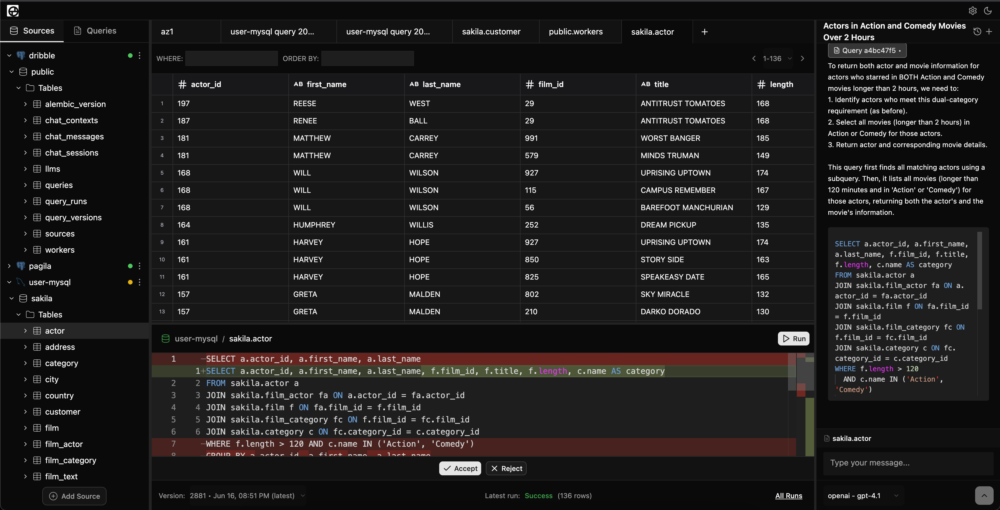

# DribbleSQL

**AI-powered, open source IDE for databases.**



DribbleSQL is a web-based SQL IDE with built-in AI assistance designed for working across databases. Explore and debug Postgres, MySQL, Snowflake, and more - all in one interface.

---

## 🚀 Getting Started

Make sure you have [Docker](https://www.docker.com/) and [Just](https://github.com/casey/just) installed.

Then run:

```bash
just start
```

Once running:

- Client: http://localhost:3000
- Server: http://localhost:8000

All services run in Docker containers, including per-source workers for isolation and scalability.

### Features

- 🔌 Connect to PostgreSQL and MySQL
- 🌐 Work across multiple databases from one place
- 🧭 Visualize your schema in a file tree view
- 💾 Save queries with version history
- 📊 Log query runs for observability
- ⚡ Run queries with filter and sort options
- 🤖 Context-aware AI assistant (powered by GPT)
- 🧠 Autocomplete SQL editor
- 🐳 Isolated Docker workers per data source

### License

This project is licensed under the Business Source License v1.1.

- ✅ Free for internal use, including production use within your organization.
- 🚫 Not permitted in commercial hosted products without a commercial license.

🔄 On June 16, 2028, it will convert to the Apache 2.0 License.

Want to use DribbleSQL commercially before then? Get in touch for a license.
