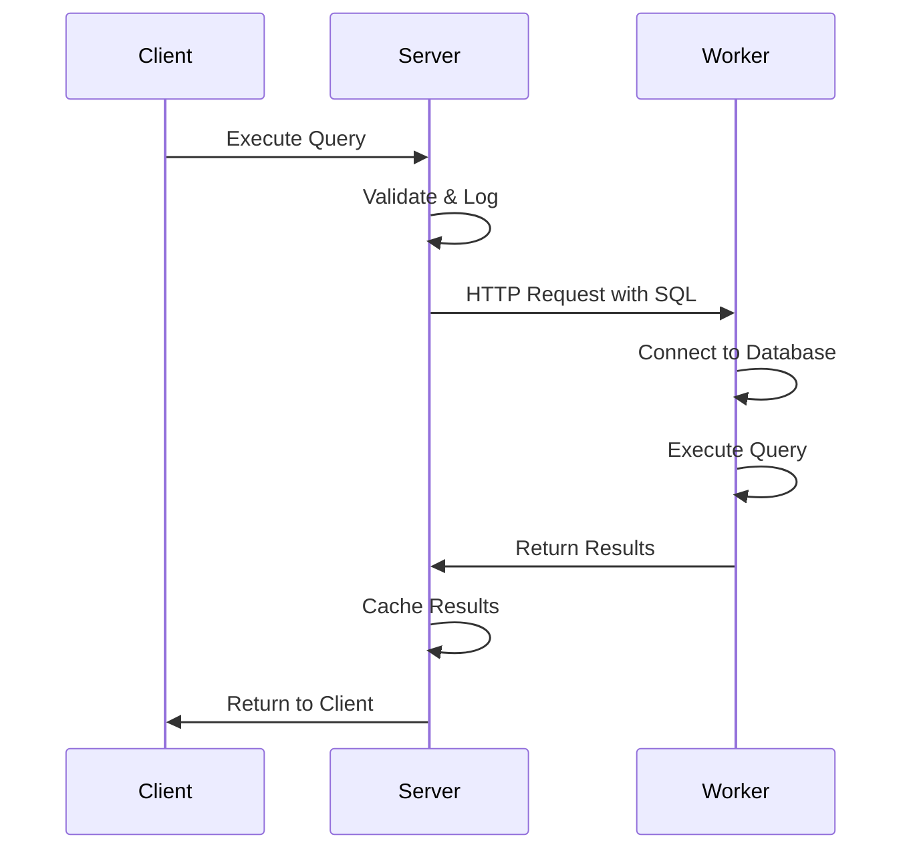

# Developer Concepts

This guide covers the technical architecture and key concepts developers need to understand when working with or extending Dribble.

## Architecture Overview

Dribble follows a distributed, container-based architecture designed for scalability, security, and isolation.

### High-Level Components

```
┌─────────────────┐    ┌─────────────────┐    ┌─────────────────┐
│     Client      │    │     Server      │    │    Workers      │
│   (React SPA)   │◄──►│   (FastAPI)     │◄──►│  (Per Database) │
└─────────────────┘    └─────────────────┘    └─────────────────┘
         │                       │                       │
         └─── HTTP API ──────────┘                       │
                                 │                       │
                                 └─── Docker Network ────┘
```

### Component Details

**Client (Frontend)**

- React 19 with TypeScript
- Vite for build tooling
- Zustand for state management
- ShadCN/UI components with Tailwind CSS
- Monaco Editor for SQL editing
- Glide Data Grid for results display

**Server (Backend)**

- FastAPI with async/await patterns
- SQLAlchemy ORM with PostgreSQL
- Pydantic for data validation
- Redis for caching and session management
- Alembic for database migrations

**Workers (Query Execution)**

- Isolated FastAPI containers per database type
- Dockerized for security and scalability
- Communicate via HTTP API over Docker network
- Support PostgreSQL and MySQL with isolated workers

## Data Models and Persistence

Understanding the data model is crucial for working with Dribble's backend.

### Core Entities

**Sources** (`sources` table)

```python
class Source:
    id: UUID
    name: str
    type: str  # 'postgresql', 'mysql', etc.
    connection_details: dict  # encrypted
    workspace_id: UUID
    created_at: datetime
    is_active: bool
```

**Queries** (`queries` table)

```python
class Query:
    id: UUID
    name: str
    workspace_id: UUID
    created_at: datetime
    updated_at: datetime
    is_ephemeral: bool  # temporary queries
    preview_key: str    # for sharing
```

**Query Versions** (`query_versions` table)

```python
class QueryVersion:
    id: UUID
    query_id: UUID
    version_number: int
    sql_content: str
    created_at: datetime
    created_by: str
```

**Query Runs** (`query_runs` table)

```python
class QueryRun:
    id: UUID
    query_version_id: UUID
    source_id: UUID
    status: str  # 'running', 'success', 'error'
    execution_time_ms: int
    row_count: int
    error_message: str
    created_at: datetime
    results: dict  # cached results for recent runs
```

### Query Lifecycle

1. **Creation**: Query created in `queries` table
2. **Versioning**: Each significant change creates new `query_version`
3. **Execution**: Run creates `query_run` record
4. **Results**: Results cached in run record or external storage
5. **History**: Full audit trail maintained across all tables

## Worker Architecture

Workers are the heart of Dribble's query execution system, providing isolation and scalability.

### Worker Design Principles

**Isolation**: Each database connection gets its own worker container
**Security**: Workers run with minimal privileges and network access
**Scalability**: Workers can be distributed across multiple hosts
**Fault Tolerance**: Failed workers are automatically restarted

### Worker Communication



## State Management Architecture

The frontend uses Zustand with a carefully designed store architecture.

### Store Organization

**Feature-Based Stores**:

- `useQueryStore` - Query CRUD and active state
- `useTabManagerStore` - Tab management and navigation
- `useChatStore` - AI chat messages and context
- `useSourceStore` - Database connections
- `useUIStore` - Interface state (sidebars, modals)

**Composed Stores**:

- `useComposedTabStore` - Combines query and tab state
- Cross-store dependencies managed through selectors

### Store Patterns

**Async Actions**:

```typescript
const useQueryStore = create<QueryStore>((set, get) => ({
  queries: [],
  loading: false,

  async fetchQueries() {
    set({ loading: true });
    try {
      const queries = await api.getQueries();
      set({ queries, loading: false });
    } catch (error) {
      set({ loading: false });
      // Handle error
    }
  }
}));
```

**Store Composition**:

```typescript
const useComposedTabStore = () => {
  const queries = useQueryStore((state) => state.queries);
  const activeTab = useTabManagerStore((state) => state.activeTab);

  return {
    activeQuery: queries.find((q) => q.id === activeTab)
    // ... composed logic
  };
};
```

## API Design Patterns

The FastAPI backend follows consistent patterns for maintainability.

### Route Organization

```
/routes/
├── query.py          # Query CRUD operations
├── query_execution.py # Query execution endpoints
├── query_version.py   # Version management
├── sources.py         # Source management
├── chat.py           # AI chat endpoints
└── llm.py            # LLM configuration
```

### Controller Pattern

Routes delegate to controllers for business logic:

```python
# routes/query.py
@router.post("/queries/", response_model=QueryResponse)
async def create_query(
    query_data: QueryCreate,
    db: Session = Depends(get_db)
):
    return await query_controller.create_query(db, query_data)

# controllers/query.py
async def create_query(db: Session, query_data: QueryCreate):
    # Business logic here
    query = Query(**query_data.dict())
    db.add(query)
    await db.commit()
    return query
```

### Schema Validation

Pydantic schemas provide request/response validation:

```python
class QueryCreate(BaseModel):
    name: str = Field(..., min_length=1, max_length=255)
    sql_content: str
    source_id: UUID

class QueryResponse(BaseModel):
    id: UUID
    name: str
    created_at: datetime
    version_count: int

    class Config:
        from_attributes = True
```

## AI Integration Architecture

The AI assistant uses a sophisticated context management system.

### Context Assembly

When a user asks a question, the system assembles context from:

1. **Current Query**: The SQL being worked on
2. **Database Schema**: Relevant tables and columns
3. **Chat History**: Previous conversation context

## Query Execution Pipeline

Understanding the execution pipeline helps with debugging and optimization.

### Execution Flow

1. **Validation**: SQL parsing and basic validation
2. **Routing**: Determine which worker to use
3. **Worker Selection**: Find or spawn appropriate worker
4. **Execution**: Send query to worker for execution
5. **Result Processing**: Handle results, errors, and caching
6. **Logging**: Record execution details for history

### Error Handling

```python
class QueryExecutionService:
    async def execute_query(
        self,
        sql: str,
        source_id: UUID
    ) -> QueryResult:
        try:
            # Get worker for source
            worker = await self.get_worker(source_id)

            # Execute query
            result = await worker.execute(sql)

            # Log successful execution
            await self.log_query_run(
                source_id=source_id,
                sql=sql,
                status="success",
                execution_time=result.execution_time,
                row_count=result.row_count
            )

            return result

        except WorkerUnavailableError:
            # Restart worker and retry
            await self.restart_worker(source_id)
            return await self.execute_query(sql, source_id)

        except SQLError as e:
            # Log error and return to user
            await self.log_query_run(
                source_id=source_id,
                sql=sql,
                status="error",
                error_message=str(e)
            )
            raise
```

## Performance Considerations

Key areas for performance optimization in Dribble.

### Frontend Optimization

**Virtual Scrolling**: Large result sets use virtualization
**Code Splitting**: Features loaded on demand
**State Normalization**: Efficient data structures in stores
**Debounced Updates**: Auto-save and API calls are debounced

### Backend Optimization

**Connection Pooling**: Database connections are pooled
**Query Caching**: Results cached for repeated queries
**Async Processing**: All I/O operations use async/await
**Worker Pooling**: Workers reused across multiple queries

### Database Optimization

**Indexing**: Key tables have appropriate indexes
**Query Optimization**: Complex queries are optimized
**Connection Limits**: Database connections are managed
**Migration Performance**: Schema changes are efficient

## Development Workflow

Best practices for developing with Dribble.

### Local Development

```bash
# Start development environment
just start

# Run tests
just test

# Check code quality
cd server && ruff check .
cd client && yarn lint
```

### Testing Strategy

- **Unit Tests**: Individual components and functions
- **Integration Tests**: API endpoints and database operations

### Code Quality

- **Ruff** for Python linting and formatting
- **ESLint** for TypeScript/React code quality
- **Pre-commit hooks** for automated checks
- **Type checking** with mypy and TypeScript
