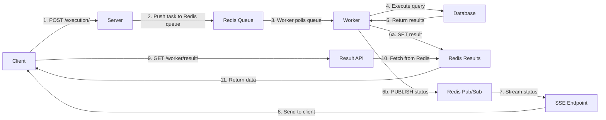

# Simplified Query Execution Flow

## Overview

This document describes the simplified query execution flow that was implemented to remove unnecessary complexity and make the system more reliable and maintainable.

## What Was Simplified

### 1. **Removed Status Mapping**

- **Before**: Worker status "success" was mapped to "completed", "error" to "failed", etc.
- **After**: Worker uses simple, consistent statuses: "success", "error", "running", "pending", "cancelled"
- **Benefit**: No confusion about status values between components

### 2. **Removed Duplicate Task Types**

- **Before**: Multiple names for same operation (e.g., "execute" vs "query_execution", "cancel" vs "query_cancel")
- **After**: One consistent task type per operation:
  - `query_execution` - Execute a query
  - `query_cancel` - Cancel a query
  - `connect` - Connect to database
  - `test_db` - Test database connection
  - `schema` - Get database schema
  - `disconnect` - Disconnect from database
  - `connected` - List connected sources
- **Benefit**: Clear, unambiguous task routing

### 3. **Simplified Task Result Format**

- **Before**: Complex `format_task_result` function with nested logic
- **After**: Simple dictionary with consistent fields:

```python
{
    "task_id": task_id,
    "status": "success",
    "data": result_data,  # Optional
    "error": error_msg    # Optional on error
}
```

- **Benefit**: Easy to understand and debug

### 4. **Removed Legacy Code**

- Deleted `task_adapter.py`
- Removed `effective_id` property
- Removed `connection_params` nesting
- Removed backward compatibility checks
- **Benefit**: Cleaner codebase without confusing legacy paths

### 5. **Simplified Redis Keys**

- **Result Storage**: `query_run:{task_id}:result`
- **Status Channel**: `task_status:{task_id}`
- **Benefit**: Predictable, easy to debug

## The New Simple Flow



### Step-by-Step

1. **Client submits query execution request**

   ```bash
   POST /execution/
   {
     "query_version_id": "uuid"
   }
   ```

2. **Server creates simple task and pushes to Redis**

   ```python
   task_data = {
       "task_type": "query_execution",
       "task_id": str(query_run.id),
       "source_id": str(source_id),
       "sql": query_sql,
       "role": "reader"
   }
   redis.lpush("query_tasks", json.dumps(task_data))
   ```

3. **Worker processes task**

   ```python
   # Simple task routing
   if task.task_type == "query_execution":
       handle_execute_task(task)
   ```

4. **Worker updates Redis with results**

   ```python
   # Store result
   set_result(task_id, {
       "task_id": task_id,
       "status": "success",
       "data": query_results
   })

   # Publish status
   publish_status(task_id, "success")
   ```

5. **Client receives status via SSE and fetches results**
   ```bash
   GET /worker/result/{task_id}
   ```

## Example Query Execution

```bash
# 1. Create a query
curl -X POST http://localhost:8000/query/ \
  -H "Content-Type: application/json" \
  -d '{"name": "Test Query", "source_id": "uuid"}'

# 2. Create a query version
curl -X POST http://localhost:8000/versions/ \
  -H "Content-Type: application/json" \
  -d '{
    "query_id": "query-uuid",
    "sql": "SELECT 1 as test",
    "save_trigger": "manual"
  }'

# 3. Execute the query
curl -X POST http://localhost:8000/execution/ \
  -H "Content-Type: application/json" \
  -H "X-Client-ID: test-client" \
  -d '{"query_version_id": "version-uuid"}'

# Response:
{
  "task_id": "task-uuid",
  "status": "queued",
  "message": "Query execution queued successfully"
}

# 4. Get results
curl -X GET http://localhost:8000/worker/result/task-uuid

# Response:
{
  "task_id": "task-uuid",
  "status": "success",
  "data": [{"test": 1}],
  "row_count": 1,
  "execution_time_ms": 4
}
```

## Benefits

1. **Simplicity**: The flow is straightforward and easy to understand
2. **Reliability**: Fewer moving parts means fewer things can go wrong
3. **Debuggability**: Simple keys and consistent formats make debugging easier
4. **Performance**: Direct operations without unnecessary abstractions
5. **Maintainability**: Clean code that's easy to modify and extend

## Implementation Files

### Worker Side

- `worker/task_manager.py` - Simplified task routing and handling
- `worker/common/models.py` - Simplified TaskRequest model
- `worker/main.py` - Removed task_adapter usage

### Server Side

- `server/app/core/query_execution_service.py` - Direct task submission
- `server/app/core/task_service.py` - Simplified result retrieval
- `server/app/core/results_streaming_service.py` - Direct status handling

## Future Considerations

- Task priorities could be added with different Redis queues
- Task cancellation could be enhanced to actually kill running queries
- Different worker pools for different database types
- Task retry logic for transient failures
