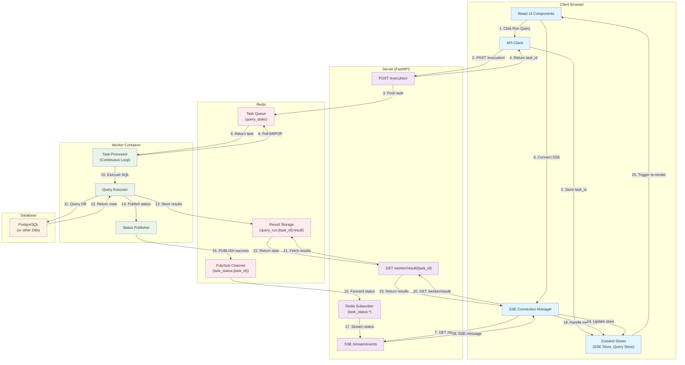
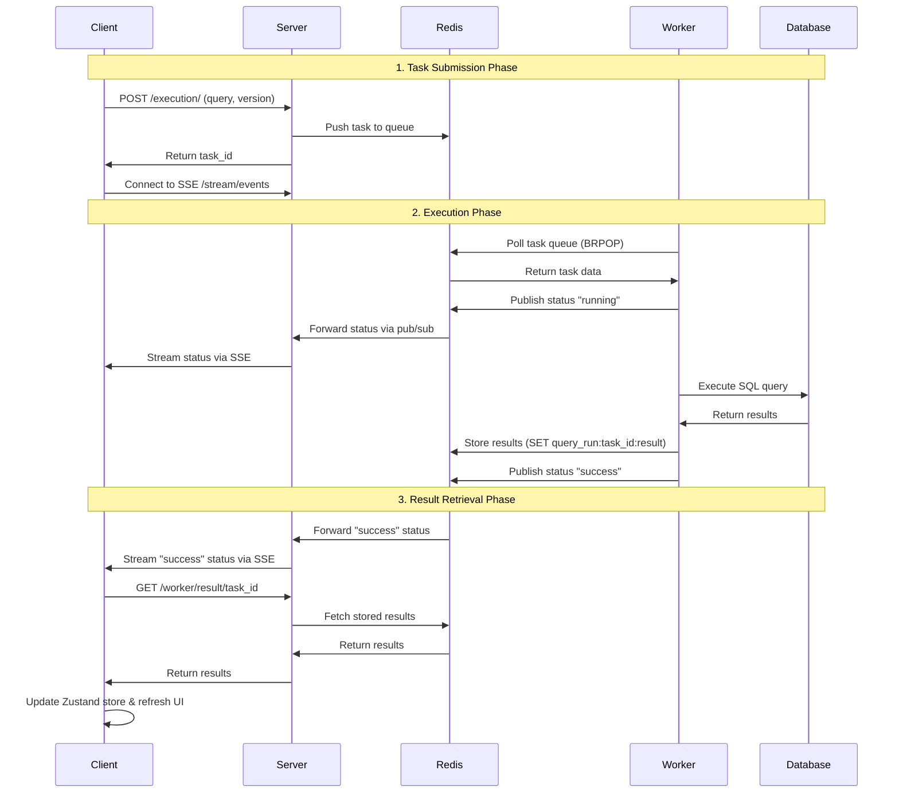
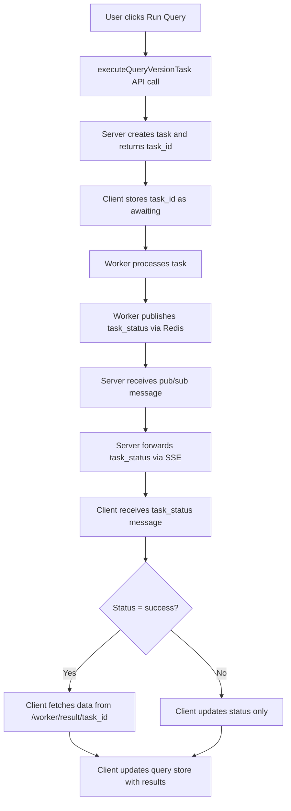

# Task-Based SSE Query Execution Flow

## Overview

This document describes Dribble's new task-based query execution architecture that uses Server-Sent Events (SSE) and Redis pub/sub for real-time status updates. This system replaced the previous synchronous worker execution model to provide better scalability and real-time feedback.

## High-Level Architecture

The new architecture separates query execution into three distinct phases:

1. **Task Submission**: Client submits query execution task and receives a `task_id`
2. **Asynchronous Execution**: Worker processes the task and publishes status updates via Redis
3. **Result Retrieval**: Client receives status updates via SSE and fetches results when ready

### Key Benefits

- **Non-blocking**: Client doesn't wait for query completion
- **Real-time Updates**: Status updates via SSE provide immediate feedback
- **Scalable**: Workers can process tasks independently
- **Resilient**: Tasks persist in Redis and can be recovered

## Architecture Components

### 1. Worker (`/worker`)

- Processes tasks from Redis queue in a continuous loop
- Executes queries against databases
- Publishes status updates to Redis pub/sub
- Stores results in Redis with TTL

### 2. Server (`/server`)

- Provides REST API for task submission
- Subscribes to Redis pub/sub for task status
- Streams status updates to clients via SSE
- Proxies result retrieval from worker storage

### 3. Client (`/client`)

- Submits tasks via REST API
- Maintains SSE connection for real-time updates
- Manages task state in Zustand stores
- Automatically fetches and displays results

## Architecture Diagram



## Sequence Flow Diagram



## Detailed Implementation Flow

### Phase 1: Task Submission

#### Client Side (`client/src/shared/lib/api.ts`)

```typescript
// Submit query for execution, returns task_id instead of results
export async function executeQueryVersionTask(
  queryVersionId: string,
  modifiers?: QueryModifiers
): Promise<string> {
  const response = await apiClient.post(`/execution/`, {
    query_version_id: queryVersionId,
    modifiers: modifiers || {}
  });
  return response.data.task_id; // Returns task_id, not query_run_id
}
```

#### Server Side (`server/app/routes/execution.py`)

- Receives query execution request
- Creates task object with SQL, modifiers, source info
- Pushes task to Redis queue `query_tasks`
- Returns `task_id` to client immediately

#### Task Storage in Redis

```python
# Task stored as JSON in Redis queue
task = {
    "id": task_id,
    "task_type": "execute",
    "sql": query_sql,
    "modifiers": modifiers,
    "source_id": source_id,
    "role": "reader"
}
redis.lpush("query_tasks", json.dumps(task))
```

### Phase 2: Asynchronous Execution

#### Worker Task Processing (`worker/task_manager.py`)

```python
def handle_execute_task(task: TaskRequest):
    """Handle query execution with modifiers"""
    try:
        # Set initial status
        set_result(task.id, {"status": "running"})

        # Execute query
        result = execute_query_with_modifiers(
            sql=task.sql,
            modifiers=task.modifiers,
            engine=connection_info.engine,
            id=task.id,
        )

        # Store results and publish success status
        set_result(task.id, {"status": "success", "data": result["data"]})
        publish_status(task.id, "success")  # Key: publishes to Redis pub/sub

    except Exception as e:
        set_result(task.id, {"status": "error", "error": str(e)})
        publish_status(task.id, "error")
```

#### Redis Operations

- **Results Storage**: `SET query_run:{task_id}:result` (TTL: 15 minutes)
- **Status Publishing**: `PUBLISH task_status:{task_id}` with JSON message

### Phase 3: Real-time Status Updates

#### Server Redis Subscriber (`server/app/core/redis_subscriber.py`)

```python
async def _subscribe_to_status(self):
    """Subscribe to task_status:* channels"""
    pubsub_redis = REDIS.pubsub()
    await pubsub_redis.psubscribe("task_status:*")

    async for message in pubsub_redis.listen():
        if message["type"] == "pmessage":
            await self._handle_message(message)
```

#### SSE Streaming (`server/app/routes/sse.py`)

```python
@router.get("/events")
async def stream_events():
    """Stream task status updates to client via SSE"""
    async def generate_status_events():
        while client_connected:
            active_task_ids = task_status_subscriber.get_all_active_tasks()

            for task_id in active_task_ids:
                status_msg = task_status_subscriber.get_status(task_id)
                sse_message = {
                    "type": "task_status",
                    "task_id": task_id,
                    "status": status_msg.get("status"),
                    "timestamp": msg_timestamp,
                }
                yield f"data: {json.dumps(sse_message)}\n\n"
```

### Phase 4: Result Retrieval & UI Updates

#### Client SSE Handler (`client/src/shared/services/SSEConnectionManager.ts`)

```typescript
private async handleMessage(message: any) {
  if (message.type === 'task_status') {
    const { task_id, status } = message;

    if (status === 'success') {
      // Fetch actual results when task completes
      try {
        const result = await getWorkerTaskResult(task_id);
        this.onTaskResult?.({
          task_id,
          status: 'success',
          data: result
        });
      } catch (error) {
        // Handle fetch error
      }
    } else {
      // Handle other statuses (running, error)
      this.onTaskResult?.({ task_id, status });
    }
  }
}
```

#### Result Fetching API (`client/src/shared/lib/api.ts`)

```typescript
export async function getWorkerTaskResult(taskId: string): Promise<WorkerTaskResult> {
  const response = await apiClient.get(`/worker/result/${taskId}`);
  return response.data;
}
```

## State Management with Zustand

### SSE Store (`client/src/shared/store/useSSEStore.ts`)

The SSE store manages task state and coordinates between SSE updates and query execution:

```typescript
interface TaskResult {
  task_id: string;
  status: 'pending' | 'running' | 'success' | 'error' | 'cancelled';
  data?: any;
  error?: string;
  timestamp?: number;
}

// Key methods for task-based flow:
registerQueryAwaitingTask: (queryId: string, taskId: string) => void;
updateTaskResult: (result: TaskResult) => void;
getQueryLatestTask: (queryId: string) => TaskResult | null;
```

#### Task State Lifecycle

1. **Registration**: When query runs, task is registered as "pending"

   ```typescript
   sseStore.registerQueryAwaitingTask(queryId, taskId);
   ```

2. **Status Updates**: SSE messages update task status

   ```typescript
   sseStore.updateTaskResult({
     task_id: taskId,
     status: "running" // or 'success', 'error'
   });
   ```

3. **Result Storage**: Final results stored in task state
   ```typescript
   sseStore.updateTaskResult({
     task_id: taskId,
     status: "success",
     data: queryResults
   });
   ```

### Query Store Integration

The query store is updated automatically when task results arrive:

```typescript
// In QueryExecutionServiceSSE
private onTaskResult = (result: TaskResult) => {
  if (result.status === 'success' && result.data) {
    // Update query store with new results
    const queryStore = useQueryStore.getState();
    queryStore.updateQueryWithNewResults(queryId, result.data);
  }
};
```

## UI Updates and Table Refresh

### Table Data Refresh (`client/src/components/QueryResultsTable.tsx`)

The results table automatically updates when new data arrives:

1. **Hook Integration**: Uses `useQueryStreamHook` to get latest results

   ```typescript
   const { latestResult, isLoading } = useQueryStreamHook(queryId);
   ```

2. **Automatic Re-render**: Component re-renders when Zustand state changes

   ```typescript
   // Table re-renders when latestResult changes
   <DataGrid data={latestResult?.data || []} loading={isLoading} />
   ```

3. **Loading States**: Different loading states based on task status
   ```typescript
   const isLoading = latestResult?.status === "pending" || latestResult?.status === "running";
   const hasError = latestResult?.status === "error";
   const hasData = latestResult?.status === "success" && latestResult.data;
   ```

### Execution Status Indicators

Status indicators provide real-time feedback:

```typescript
// Status indicator based on task state
{
  latestResult?.status === "running" && <LoadingSpinner />;
}
{
  latestResult?.status === "success" && <SuccessIcon />;
}
{
  latestResult?.status === "error" && <ErrorIcon />;
}
```

## Data Flow: Status vs Results

### Two-Channel Data Flow

The architecture uses two separate channels for optimal performance:

#### 1. Status Channel (Fast, Lightweight)

- **Transport**: Redis pub/sub → SSE
- **Content**: Task status only (`pending`, `running`, `success`, `error`)
- **Purpose**: Real-time feedback, loading states
- **Frequency**: Immediate on status change

#### 2. Results Channel (On-Demand, Full Data)

- **Transport**: HTTP REST API
- **Content**: Complete query results (rows, metadata, errors)
- **Purpose**: Display actual data
- **Frequency**: Only when status is `success`

### Why Separate Channels?

1. **Performance**: SSE streams only lightweight status, not heavy result data
2. **Reliability**: Results stored in Redis with TTL, can be refetched if needed
3. **Scalability**: SSE connection handles many concurrent tasks efficiently
4. **Error Handling**: Failed result fetches don't break status updates

## Error Handling and Recovery

### Task Timeouts

- Server times out tasks after 30 seconds if no status update
- Client can retry task submission or show timeout error

### Connection Recovery

- SSE reconnects automatically on disconnect
- Task state preserved in Zustand during reconnection
- Results remain available in Redis storage

### Result Fetch Failures

- If result fetch fails, client shows error but maintains task status
- User can manually retry result fetching
- Results stored with TTL allow for recovery

## Migration Notes

### Key Changes from Previous Architecture

1. **API Changes**:

   - `POST /execution/` now returns `task_id` instead of `query_run_id`
   - New endpoint `GET /worker/result/{task_id}` for result retrieval

2. **State Management**:

   - `RunResult` → `TaskResult` interface
   - `activeRuns` → `activeTasks` tracking
   - All store methods renamed from "run" to "task" terminology

3. **Component Updates**:
   - Query execution components use task-based hooks
   - Table components automatically refresh on new task results
   - Loading states based on task status rather than direct API calls

This new architecture provides a more scalable, responsive, and resilient query execution system that better separates concerns and improves user experience with real-time feedback.

## Additional Diagrams

### Client Flow Decision Tree

This diagram shows the client-side decision process when receiving task status updates:



## Diagram of the flow

<svg aria-roledescription="flowchart-v2" role="graphics-document document" viewBox="-8 -8 630.53125 1122.15625" style="max-width: 630.53125px;" xmlns="http://www.w3.org/2000/svg" width="100%" id="mermaid-svg-1751223913711-nh67qarqh"><style>#mermaid-svg-1751223913711-nh67qarqh{font-family:"trebuchet ms",verdana,arial,sans-serif;font-size:16px;fill:rgba(204, 204, 204, 0.87);}#mermaid-svg-1751223913711-nh67qarqh .error-icon{fill:#bf616a;}#mermaid-svg-1751223913711-nh67qarqh .error-text{fill:#bf616a;stroke:#bf616a;}#mermaid-svg-1751223913711-nh67qarqh .edge-thickness-normal{stroke-width:2px;}#mermaid-svg-1751223913711-nh67qarqh .edge-thickness-thick{stroke-width:3.5px;}#mermaid-svg-1751223913711-nh67qarqh .edge-pattern-solid{stroke-dasharray:0;}#mermaid-svg-1751223913711-nh67qarqh .edge-pattern-dashed{stroke-dasharray:3;}#mermaid-svg-1751223913711-nh67qarqh .edge-pattern-dotted{stroke-dasharray:2;}#mermaid-svg-1751223913711-nh67qarqh .marker{fill:rgba(204, 204, 204, 0.87);stroke:rgba(204, 204, 204, 0.87);}#mermaid-svg-1751223913711-nh67qarqh .marker.cross{stroke:rgba(204, 204, 204, 0.87);}#mermaid-svg-1751223913711-nh67qarqh svg{font-family:"trebuchet ms",verdana,arial,sans-serif;font-size:16px;}#mermaid-svg-1751223913711-nh67qarqh .label{font-family:"trebuchet ms",verdana,arial,sans-serif;color:rgba(204, 204, 204, 0.87);}#mermaid-svg-1751223913711-nh67qarqh .cluster-label text{fill:#ffffff;}#mermaid-svg-1751223913711-nh67qarqh .cluster-label span,#mermaid-svg-1751223913711-nh67qarqh p{color:#ffffff;}#mermaid-svg-1751223913711-nh67qarqh .label text,#mermaid-svg-1751223913711-nh67qarqh span,#mermaid-svg-1751223913711-nh67qarqh p{fill:rgba(204, 204, 204, 0.87);color:rgba(204, 204, 204, 0.87);}#mermaid-svg-1751223913711-nh67qarqh .node rect,#mermaid-svg-1751223913711-nh67qarqh .node circle,#mermaid-svg-1751223913711-nh67qarqh .node ellipse,#mermaid-svg-1751223913711-nh67qarqh .node polygon,#mermaid-svg-1751223913711-nh67qarqh .node path{fill:#1a1a1a;stroke:#2a2a2a;stroke-width:1px;}#mermaid-svg-1751223913711-nh67qarqh .flowchart-label text{text-anchor:middle;}#mermaid-svg-1751223913711-nh67qarqh .node .label{text-align:center;}#mermaid-svg-1751223913711-nh67qarqh .node.clickable{cursor:pointer;}#mermaid-svg-1751223913711-nh67qarqh .arrowheadPath{fill:#e5e5e5;}#mermaid-svg-1751223913711-nh67qarqh .edgePath .path{stroke:rgba(204, 204, 204, 0.87);stroke-width:2.0px;}#mermaid-svg-1751223913711-nh67qarqh .flowchart-link{stroke:rgba(204, 204, 204, 0.87);fill:none;}#mermaid-svg-1751223913711-nh67qarqh .edgeLabel{background-color:#1a1a1a99;text-align:center;}#mermaid-svg-1751223913711-nh67qarqh .edgeLabel rect{opacity:0.5;background-color:#1a1a1a99;fill:#1a1a1a99;}#mermaid-svg-1751223913711-nh67qarqh .labelBkg{background-color:rgba(26, 26, 26, 0.5);}#mermaid-svg-1751223913711-nh67qarqh .cluster rect{fill:rgba(64, 64, 64, 0.47);stroke:#30373a;stroke-width:1px;}#mermaid-svg-1751223913711-nh67qarqh .cluster text{fill:#ffffff;}#mermaid-svg-1751223913711-nh67qarqh .cluster span,#mermaid-svg-1751223913711-nh67qarqh p{color:#ffffff;}#mermaid-svg-1751223913711-nh67qarqh div.mermaidTooltip{position:absolute;text-align:center;max-width:200px;padding:2px;font-family:"trebuchet ms",verdana,arial,sans-serif;font-size:12px;background:#88c0d0;border:1px solid #30373a;border-radius:2px;pointer-events:none;z-index:100;}#mermaid-svg-1751223913711-nh67qarqh .flowchartTitleText{text-anchor:middle;font-size:18px;fill:rgba(204, 204, 204, 0.87);}#mermaid-svg-1751223913711-nh67qarqh :root{--mermaid-font-family:"trebuchet ms",verdana,arial,sans-serif;}</style><g><marker orient="auto" markerHeight="12" markerWidth="12" markerUnits="userSpaceOnUse" refY="5" refX="6" viewBox="0 0 10 10" class="marker flowchart" id="mermaid-svg-1751223913711-nh67qarqh_flowchart-pointEnd"><path style="stroke-width: 1; stroke-dasharray: 1, 0;" class="arrowMarkerPath" d="M 0 0 L 10 5 L 0 10 z"/></marker><marker orient="auto" markerHeight="12" markerWidth="12" markerUnits="userSpaceOnUse" refY="5" refX="4.5" viewBox="0 0 10 10" class="marker flowchart" id="mermaid-svg-1751223913711-nh67qarqh_flowchart-pointStart"><path style="stroke-width: 1; stroke-dasharray: 1, 0;" class="arrowMarkerPath" d="M 0 5 L 10 10 L 10 0 z"/></marker><marker orient="auto" markerHeight="11" markerWidth="11" markerUnits="userSpaceOnUse" refY="5" refX="11" viewBox="0 0 10 10" class="marker flowchart" id="mermaid-svg-1751223913711-nh67qarqh_flowchart-circleEnd"><circle style="stroke-width: 1; stroke-dasharray: 1, 0;" class="arrowMarkerPath" r="5" cy="5" cx="5"/></marker><marker orient="auto" markerHeight="11" markerWidth="11" markerUnits="userSpaceOnUse" refY="5" refX="-1" viewBox="0 0 10 10" class="marker flowchart" id="mermaid-svg-1751223913711-nh67qarqh_flowchart-circleStart"><circle style="stroke-width: 1; stroke-dasharray: 1, 0;" class="arrowMarkerPath" r="5" cy="5" cx="5"/></marker><marker orient="auto" markerHeight="11" markerWidth="11" markerUnits="userSpaceOnUse" refY="5.2" refX="12" viewBox="0 0 11 11" class="marker cross flowchart" id="mermaid-svg-1751223913711-nh67qarqh_flowchart-crossEnd"><path style="stroke-width: 2; stroke-dasharray: 1, 0;" class="arrowMarkerPath" d="M 1,1 l 9,9 M 10,1 l -9,9"/></marker><marker orient="auto" markerHeight="11" markerWidth="11" markerUnits="userSpaceOnUse" refY="5.2" refX="-1" viewBox="0 0 11 11" class="marker cross flowchart" id="mermaid-svg-1751223913711-nh67qarqh_flowchart-crossStart"><path style="stroke-width: 2; stroke-dasharray: 1, 0;" class="arrowMarkerPath" d="M 1,1 l 9,9 M 10,1 l -9,9"/></marker><g class="root"><g class="clusters"/><g class="edgePaths"><path marker-end="url(#mermaid-svg-1751223913711-nh67qarqh_flowchart-pointEnd)" style="fill:none;" class="edge-thickness-normal edge-pattern-solid flowchart-link LS-A LE-B" id="L-A-B-0" d="M347.711,33.5L347.711,37.667C347.711,41.833,347.711,50.167,347.711,57.617C347.711,65.067,347.711,71.633,347.711,74.917L347.711,78.2"/><path marker-end="url(#mermaid-svg-1751223913711-nh67qarqh_flowchart-pointEnd)" style="fill:none;" class="edge-thickness-normal edge-pattern-solid flowchart-link LS-B LE-C" id="L-B-C-0" d="M347.711,117L347.711,121.167C347.711,125.333,347.711,133.667,347.711,141.117C347.711,148.567,347.711,155.133,347.711,158.417L347.711,161.7"/><path marker-end="url(#mermaid-svg-1751223913711-nh67qarqh_flowchart-pointEnd)" style="fill:none;" class="edge-thickness-normal edge-pattern-solid flowchart-link LS-C LE-D" id="L-C-D-0" d="M347.711,200.5L347.711,204.667C347.711,208.833,347.711,217.167,347.711,224.617C347.711,232.067,347.711,238.633,347.711,241.917L347.711,245.2"/><path marker-end="url(#mermaid-svg-1751223913711-nh67qarqh_flowchart-pointEnd)" style="fill:none;" class="edge-thickness-normal edge-pattern-solid flowchart-link LS-D LE-E" id="L-D-E-0" d="M347.711,284L347.711,288.167C347.711,292.333,347.711,300.667,347.711,308.117C347.711,315.567,347.711,322.133,347.711,325.417L347.711,328.7"/><path marker-end="url(#mermaid-svg-1751223913711-nh67qarqh_flowchart-pointEnd)" style="fill:none;" class="edge-thickness-normal edge-pattern-solid flowchart-link LS-E LE-F" id="L-E-F-0" d="M347.711,367.5L347.711,371.667C347.711,375.833,347.711,384.167,347.711,391.617C347.711,399.067,347.711,405.633,347.711,408.917L347.711,412.2"/><path marker-end="url(#mermaid-svg-1751223913711-nh67qarqh_flowchart-pointEnd)" style="fill:none;" class="edge-thickness-normal edge-pattern-solid flowchart-link LS-F LE-G" id="L-F-G-0" d="M347.711,451L347.711,455.167C347.711,459.333,347.711,467.667,347.711,475.117C347.711,482.567,347.711,489.133,347.711,492.417L347.711,495.7"/><path marker-end="url(#mermaid-svg-1751223913711-nh67qarqh_flowchart-pointEnd)" style="fill:none;" class="edge-thickness-normal edge-pattern-solid flowchart-link LS-G LE-H" id="L-G-H-0" d="M347.711,534.5L347.711,538.667C347.711,542.833,347.711,551.167,347.711,558.617C347.711,566.067,347.711,572.633,347.711,575.917L347.711,579.2"/><path marker-end="url(#mermaid-svg-1751223913711-nh67qarqh_flowchart-pointEnd)" style="fill:none;" class="edge-thickness-normal edge-pattern-solid flowchart-link LS-H LE-I" id="L-H-I-0" d="M347.711,618L347.711,622.167C347.711,626.333,347.711,634.667,347.711,642.117C347.711,649.567,347.711,656.133,347.711,659.417L347.711,662.7"/><path marker-end="url(#mermaid-svg-1751223913711-nh67qarqh_flowchart-pointEnd)" style="fill:none;" class="edge-thickness-normal edge-pattern-solid flowchart-link LS-I LE-J" id="L-I-J-0" d="M347.711,701.5L347.711,705.667C347.711,709.833,347.711,718.167,347.777,725.7C347.843,733.234,347.975,739.967,348.041,743.334L348.107,746.701"/><path marker-end="url(#mermaid-svg-1751223913711-nh67qarqh_flowchart-pointEnd)" style="fill:none;" class="edge-thickness-normal edge-pattern-solid flowchart-link LS-J LE-K" id="L-J-K-0" d="M298.902,871.847L279.348,885.69C259.794,899.533,220.686,927.22,201.132,945.888C181.578,964.556,181.578,974.206,181.578,979.031L181.578,983.856"/><path marker-end="url(#mermaid-svg-1751223913711-nh67qarqh_flowchart-pointEnd)" style="fill:none;" class="edge-thickness-normal edge-pattern-solid flowchart-link LS-J LE-L" id="L-J-L-0" d="M397.52,871.847L416.907,885.69C436.295,899.533,475.069,927.22,494.456,945.888C513.844,964.556,513.844,974.206,513.844,979.031L513.844,983.856"/><path marker-end="url(#mermaid-svg-1751223913711-nh67qarqh_flowchart-pointEnd)" style="fill:none;" class="edge-thickness-normal edge-pattern-solid flowchart-link LS-K LE-M" id="L-K-M-0" d="M181.578,1022.656L181.578,1026.823C181.578,1030.99,181.578,1039.323,197.302,1047.441C213.025,1055.559,244.472,1063.462,260.195,1067.413L275.919,1071.364"/><path marker-end="url(#mermaid-svg-1751223913711-nh67qarqh_flowchart-pointEnd)" style="fill:none;" class="edge-thickness-normal edge-pattern-solid flowchart-link LS-L LE-M" id="L-L-M-0" d="M513.844,1022.656L513.844,1026.823C513.844,1030.99,513.844,1039.323,498.12,1047.441C482.397,1055.559,450.95,1063.462,435.227,1067.413L419.503,1071.364"/></g><g class="edgeLabels"><g class="edgeLabel"><g transform="translate(0, 0)" class="label"><foreignObject height="0" width="0"><div style="display: inline-block; white-space: nowrap;" xmlns="http://www.w3.org/1999/xhtml"><span class="edgeLabel"></span></div></foreignObject></g></g><g class="edgeLabel"><g transform="translate(0, 0)" class="label"><foreignObject height="0" width="0"><div style="display: inline-block; white-space: nowrap;" xmlns="http://www.w3.org/1999/xhtml"><span class="edgeLabel"></span></div></foreignObject></g></g><g class="edgeLabel"><g transform="translate(0, 0)" class="label"><foreignObject height="0" width="0"><div style="display: inline-block; white-space: nowrap;" xmlns="http://www.w3.org/1999/xhtml"><span class="edgeLabel"></span></div></foreignObject></g></g><g class="edgeLabel"><g transform="translate(0, 0)" class="label"><foreignObject height="0" width="0"><div style="display: inline-block; white-space: nowrap;" xmlns="http://www.w3.org/1999/xhtml"><span class="edgeLabel"></span></div></foreignObject></g></g><g class="edgeLabel"><g transform="translate(0, 0)" class="label"><foreignObject height="0" width="0"><div style="display: inline-block; white-space: nowrap;" xmlns="http://www.w3.org/1999/xhtml"><span class="edgeLabel"></span></div></foreignObject></g></g><g class="edgeLabel"><g transform="translate(0, 0)" class="label"><foreignObject height="0" width="0"><div style="display: inline-block; white-space: nowrap;" xmlns="http://www.w3.org/1999/xhtml"><span class="edgeLabel"></span></div></foreignObject></g></g><g class="edgeLabel"><g transform="translate(0, 0)" class="label"><foreignObject height="0" width="0"><div style="display: inline-block; white-space: nowrap;" xmlns="http://www.w3.org/1999/xhtml"><span class="edgeLabel"></span></div></foreignObject></g></g><g class="edgeLabel"><g transform="translate(0, 0)" class="label"><foreignObject height="0" width="0"><div style="display: inline-block; white-space: nowrap;" xmlns="http://www.w3.org/1999/xhtml"><span class="edgeLabel"></span></div></foreignObject></g></g><g class="edgeLabel"><g transform="translate(0, 0)" class="label"><foreignObject height="0" width="0"><div style="display: inline-block; white-space: nowrap;" xmlns="http://www.w3.org/1999/xhtml"><span class="edgeLabel"></span></div></foreignObject></g></g><g transform="translate(181.578125, 954.90625)" class="edgeLabel"><g transform="translate(-11.32421875, -9.25)" class="label"><foreignObject height="18.5" width="22.6484375"><div style="display: inline-block; white-space: nowrap;" xmlns="http://www.w3.org/1999/xhtml"><span class="edgeLabel">Yes</span></div></foreignObject></g></g><g transform="translate(513.84375, 954.90625)" class="edgeLabel"><g transform="translate(-9.3984375, -9.25)" class="label"><foreignObject height="18.5" width="18.796875"><div style="display: inline-block; white-space: nowrap;" xmlns="http://www.w3.org/1999/xhtml"><span class="edgeLabel">No</span></div></foreignObject></g></g><g class="edgeLabel"><g transform="translate(0, 0)" class="label"><foreignObject height="0" width="0"><div style="display: inline-block; white-space: nowrap;" xmlns="http://www.w3.org/1999/xhtml"><span class="edgeLabel"></span></div></foreignObject></g></g><g class="edgeLabel"><g transform="translate(0, 0)" class="label"><foreignObject height="0" width="0"><div style="display: inline-block; white-space: nowrap;" xmlns="http://www.w3.org/1999/xhtml"><span class="edgeLabel"></span></div></foreignObject></g></g></g><g class="nodes"><g transform="translate(347.7109375, 16.75)" id="flowchart-A-864" class="node default default flowchart-label"><rect height="33.5" width="169.65625" y="-16.75" x="-84.828125" ry="0" rx="0" style="" class="basic label-container"/><g transform="translate(-77.328125, -9.25)" style="" class="label"><rect/><foreignObject height="18.5" width="154.65625"><div style="display: inline-block; white-space: nowrap;" xmlns="http://www.w3.org/1999/xhtml"><span class="nodeLabel">User clicks Run Query</span></div></foreignObject></g></g><g transform="translate(347.7109375, 100.25)" id="flowchart-B-865" class="node default default flowchart-label"><rect height="33.5" width="253.859375" y="-16.75" x="-126.9296875" ry="0" rx="0" style="" class="basic label-container"/><g transform="translate(-119.4296875, -9.25)" style="" class="label"><rect/><foreignObject height="18.5" width="238.859375"><div style="display: inline-block; white-space: nowrap;" xmlns="http://www.w3.org/1999/xhtml"><span class="nodeLabel">executeQueryVersionTask API call</span></div></foreignObject></g></g><g transform="translate(347.7109375, 183.75)" id="flowchart-C-867" class="node default default flowchart-label"><rect height="33.5" width="295.3359375" y="-16.75" x="-147.66796875" ry="0" rx="0" style="" class="basic label-container"/><g transform="translate(-140.16796875, -9.25)" style="" class="label"><rect/><foreignObject height="18.5" width="280.3359375"><div style="display: inline-block; white-space: nowrap;" xmlns="http://www.w3.org/1999/xhtml"><span class="nodeLabel">Server creates task and returns task_id</span></div></foreignObject></g></g><g transform="translate(347.7109375, 267.25)" id="flowchart-D-869" class="node default default flowchart-label"><rect height="33.5" width="246.78125" y="-16.75" x="-123.390625" ry="0" rx="0" style="" class="basic label-container"/><g transform="translate(-115.890625, -9.25)" style="" class="label"><rect/><foreignObject height="18.5" width="231.78125"><div style="display: inline-block; white-space: nowrap;" xmlns="http://www.w3.org/1999/xhtml"><span class="nodeLabel">Client stores task_id as awaiting</span></div></foreignObject></g></g><g transform="translate(347.7109375, 350.75)" id="flowchart-E-871" class="node default default flowchart-label"><rect height="33.5" width="173.1796875" y="-16.75" x="-86.58984375" ry="0" rx="0" style="" class="basic label-container"/><g transform="translate(-79.08984375, -9.25)" style="" class="label"><rect/><foreignObject height="18.5" width="158.1796875"><div style="display: inline-block; white-space: nowrap;" xmlns="http://www.w3.org/1999/xhtml"><span class="nodeLabel">Worker processes task</span></div></foreignObject></g></g><g transform="translate(347.7109375, 434.25)" id="flowchart-F-873" class="node default default flowchart-label"><rect height="33.5" width="289.8984375" y="-16.75" x="-144.94921875" ry="0" rx="0" style="" class="basic label-container"/><g transform="translate(-137.44921875, -9.25)" style="" class="label"><rect/><foreignObject height="18.5" width="274.8984375"><div style="display: inline-block; white-space: nowrap;" xmlns="http://www.w3.org/1999/xhtml"><span class="nodeLabel">Worker publishes task_status via Redis</span></div></foreignObject></g></g><g transform="translate(347.7109375, 517.75)" id="flowchart-G-875" class="node default default flowchart-label"><rect height="33.5" width="253.296875" y="-16.75" x="-126.6484375" ry="0" rx="0" style="" class="basic label-container"/><g transform="translate(-119.1484375, -9.25)" style="" class="label"><rect/><foreignObject height="18.5" width="238.296875"><div style="display: inline-block; white-space: nowrap;" xmlns="http://www.w3.org/1999/xhtml"><span class="nodeLabel">Server receives pub/sub message</span></div></foreignObject></g></g><g transform="translate(347.7109375, 601.25)" id="flowchart-H-877" class="node default default flowchart-label"><rect height="33.5" width="267.5859375" y="-16.75" x="-133.79296875" ry="0" rx="0" style="" class="basic label-container"/><g transform="translate(-126.29296875, -9.25)" style="" class="label"><rect/><foreignObject height="18.5" width="252.5859375"><div style="display: inline-block; white-space: nowrap;" xmlns="http://www.w3.org/1999/xhtml"><span class="nodeLabel">Server forwards task_status via SSE</span></div></foreignObject></g></g><g transform="translate(347.7109375, 684.75)" id="flowchart-I-879" class="node default default flowchart-label"><rect height="33.5" width="271.921875" y="-16.75" x="-135.9609375" ry="0" rx="0" style="" class="basic label-container"/><g transform="translate(-128.4609375, -9.25)" style="" class="label"><rect/><foreignObject height="18.5" width="256.921875"><div style="display: inline-block; white-space: nowrap;" xmlns="http://www.w3.org/1999/xhtml"><span class="nodeLabel">Client receives task_status message</span></div></foreignObject></g></g><g transform="translate(347.7109375, 836.078125)" id="flowchart-J-881" class="node default default flowchart-label"><polygon style="" transform="translate(-84.578125,84.578125)" class="label-container" points="84.578125,0 169.15625,-84.578125 84.578125,-169.15625 0,-84.578125"/><g transform="translate(-60.328125, -9.25)" style="" class="label"><rect/><foreignObject height="18.5" width="120.65625"><div style="display: inline-block; white-space: nowrap;" xmlns="http://www.w3.org/1999/xhtml"><span class="nodeLabel">Status = success?</span></div></foreignObject></g></g><g transform="translate(181.578125, 1005.90625)" id="flowchart-K-883" class="node default default flowchart-label"><rect height="33.5" width="363.15625" y="-16.75" x="-181.578125" ry="0" rx="0" style="" class="basic label-container"/><g transform="translate(-174.078125, -9.25)" style="" class="label"><rect/><foreignObject height="18.5" width="348.15625"><div style="display: inline-block; white-space: nowrap;" xmlns="http://www.w3.org/1999/xhtml"><span class="nodeLabel">Client fetches data from /worker/result/task_id</span></div></foreignObject></g></g><g transform="translate(513.84375, 1005.90625)" id="flowchart-L-885" class="node default default flowchart-label"><rect height="33.5" width="201.375" y="-16.75" x="-100.6875" ry="0" rx="0" style="" class="basic label-container"/><g transform="translate(-93.1875, -9.25)" style="" class="label"><rect/><foreignObject height="18.5" width="186.375"><div style="display: inline-block; white-space: nowrap;" xmlns="http://www.w3.org/1999/xhtml"><span class="nodeLabel">Client updates status only</span></div></foreignObject></g></g><g transform="translate(347.7109375, 1089.40625)" id="flowchart-M-887" class="node default default flowchart-label"><rect height="33.5" width="294.390625" y="-16.75" x="-147.1953125" ry="0" rx="0" style="" class="basic label-container"/><g transform="translate(-139.6953125, -9.25)" style="" class="label"><rect/><foreignObject height="18.5" width="279.390625"><div style="display: inline-block; white-space: nowrap;" xmlns="http://www.w3.org/1999/xhtml"><span class="nodeLabel">Client updates query store with results</span></div></foreignObject></g></g></g></g></g></svg>

## another diagram

<svg aria-roledescription="flowchart-v2" role="graphics-document document" viewBox="-8 -8 2127.978515625 1449" style="max-width: 2127.978515625px;" xmlns="http://www.w3.org/2000/svg" width="100%" id="mermaid-svg-1751223934501-n48wmxxnf">
  <style>
    #mermaid-svg-1751223934501-n48wmxxnf{font-family:&quot;trebuchet ms&quot;,verdana,arial,sans-serif;font-size:16px;fill:rgba(204, 204, 204, 0.87);}#mermaid-svg-1751223934501-n48wmxxnf .error-icon{fill:#bf616a;}#mermaid-svg-1751223934501-n48wmxxnf .error-text{fill:#bf616a;stroke:#bf616a;}#mermaid-svg-1751223934501-n48wmxxnf .edge-thickness-normal{stroke-width:2px;}#mermaid-svg-1751223934501-n48wmxxnf .edge-thickness-thick{stroke-width:3.5px;}#mermaid-svg-1751223934501-n48wmxxnf .edge-pattern-solid{stroke-dasharray:0;}#mermaid-svg-1751223934501-n48wmxxnf .edge-pattern-dashed{stroke-dasharray:3;}#mermaid-svg-1751223934501-n48wmxxnf .edge-pattern-dotted{stroke-dasharray:2;}#mermaid-svg-1751223934501-n48wmxxnf .marker{fill:rgba(204, 204, 204, 0.87);stroke:rgba(204, 204, 204, 0.87);}#mermaid-svg-1751223934501-n48wmxxnf .marker.cross{stroke:rgba(204, 204, 204, 0.87);}#mermaid-svg-1751223934501-n48wmxxnf svg{font-family:&quot;trebuchet ms&quot;,verdana,arial,sans-serif;font-size:16px;}#mermaid-svg-1751223934501-n48wmxxnf .label{font-family:&quot;trebuchet ms&quot;,verdana,arial,sans-serif;color:rgba(204, 204, 204, 0.87);}#mermaid-svg-1751223934501-n48wmxxnf .cluster-label text{fill:#ffffff;}#mermaid-svg-1751223934501-n48wmxxnf .cluster-label span,#mermaid-svg-1751223934501-n48wmxxnf p{color:#ffffff;}#mermaid-svg-1751223934501-n48wmxxnf .label text,#mermaid-svg-1751223934501-n48wmxxnf span,#mermaid-svg-1751223934501-n48wmxxnf p{fill:rgba(204, 204, 204, 0.87);color:rgba(204, 204, 204, 0.87);}#mermaid-svg-1751223934501-n48wmxxnf .node rect,#mermaid-svg-1751223934501-n48wmxxnf .node circle,#mermaid-svg-1751223934501-n48wmxxnf .node ellipse,#mermaid-svg-1751223934501-n48wmxxnf .node polygon,#mermaid-svg-1751223934501-n48wmxxnf .node path{fill:#1a1a1a;stroke:#2a2a2a;stroke-width:1px;}#mermaid-svg-1751223934501-n48wmxxnf .flowchart-label text{text-anchor:middle;}#mermaid-svg-1751223934501-n48wmxxnf .node .label{text-align:center;}#mermaid-svg-1751223934501-n48wmxxnf .node.clickable{cursor:pointer;}#mermaid-svg-1751223934501-n48wmxxnf .arrowheadPath{fill:#e5e5e5;}#mermaid-svg-1751223934501-n48wmxxnf .edgePath .path{stroke:rgba(204, 204, 204, 0.87);stroke-width:2.0px;}#mermaid-svg-1751223934501-n48wmxxnf .flowchart-link{stroke:rgba(204, 204, 204, 0.87);fill:none;}#mermaid-svg-1751223934501-n48wmxxnf .edgeLabel{background-color:#1a1a1a99;text-align:center;}#mermaid-svg-1751223934501-n48wmxxnf .edgeLabel rect{opacity:0.5;background-color:#1a1a1a99;fill:#1a1a1a99;}#mermaid-svg-1751223934501-n48wmxxnf .labelBkg{background-color:rgba(26, 26, 26, 0.5);}#mermaid-svg-1751223934501-n48wmxxnf .cluster rect{fill:rgba(64, 64, 64, 0.47);stroke:#30373a;stroke-width:1px;}#mermaid-svg-1751223934501-n48wmxxnf .cluster text{fill:#ffffff;}#mermaid-svg-1751223934501-n48wmxxnf .cluster span,#mermaid-svg-1751223934501-n48wmxxnf p{color:#ffffff;}#mermaid-svg-1751223934501-n48wmxxnf div.mermaidTooltip{position:absolute;text-align:center;max-width:200px;padding:2px;font-family:&quot;trebuchet ms&quot;,verdana,arial,sans-serif;font-size:12px;background:#88c0d0;border:1px solid #30373a;border-radius:2px;pointer-events:none;z-index:100;}#mermaid-svg-1751223934501-n48wmxxnf .flowchartTitleText{text-anchor:middle;font-size:18px;fill:rgba(204, 204, 204, 0.87);}#mermaid-svg-1751223934501-n48wmxxnf :root{--mermaid-font-family:&quot;trebuchet ms&quot;,verdana,arial,sans-serif;}#mermaid-svg-1751223934501-n48wmxxnf .client&gt;*{fill:#e1f5fe!important;}#mermaid-svg-1751223934501-n48wmxxnf .client span{fill:#e1f5fe!important;}#mermaid-svg-1751223934501-n48wmxxnf .server&gt;*{fill:#f3e5f5!important;}#mermaid-svg-1751223934501-n48wmxxnf .server span{fill:#f3e5f5!important;}#mermaid-svg-1751223934501-n48wmxxnf .redis&gt;*{fill:#ffebee!important;}#mermaid-svg-1751223934501-n48wmxxnf .redis span{fill:#ffebee!important;}#mermaid-svg-1751223934501-n48wmxxnf .worker&gt;*{fill:#e8f5e8!important;}#mermaid-svg-1751223934501-n48wmxxnf .worker span{fill:#e8f5e8!important;}#mermaid-svg-1751223934501-n48wmxxnf .database&gt;*{fill:#fff3e0!important;}#mermaid-svg-1751223934501-n48wmxxnf .database span{fill:#fff3e0!important;}
  </style>
  <g>
    <marker orient="auto" markerHeight="12" markerWidth="12" markerUnits="userSpaceOnUse" refY="5" refX="6" viewBox="0 0 10 10" class="marker flowchart" id="mermaid-svg-1751223934501-n48wmxxnf_flowchart-pointEnd">
      <path style="stroke-width: 1; stroke-dasharray: 1, 0;" class="arrowMarkerPath" d="M 0 0 L 10 5 L 0 10 z"/>
    </marker>
    <marker orient="auto" markerHeight="12" markerWidth="12" markerUnits="userSpaceOnUse" refY="5" refX="4.5" viewBox="0 0 10 10" class="marker flowchart" id="mermaid-svg-1751223934501-n48wmxxnf_flowchart-pointStart">
      <path style="stroke-width: 1; stroke-dasharray: 1, 0;" class="arrowMarkerPath" d="M 0 5 L 10 10 L 10 0 z"/>
    </marker>
    <marker orient="auto" markerHeight="11" markerWidth="11" markerUnits="userSpaceOnUse" refY="5" refX="11" viewBox="0 0 10 10" class="marker flowchart" id="mermaid-svg-1751223934501-n48wmxxnf_flowchart-circleEnd">
      <circle style="stroke-width: 1; stroke-dasharray: 1, 0;" class="arrowMarkerPath" r="5" cy="5" cx="5"/>
    </marker>
    <marker orient="auto" markerHeight="11" markerWidth="11" markerUnits="userSpaceOnUse" refY="5" refX="-1" viewBox="0 0 10 10" class="marker flowchart" id="mermaid-svg-1751223934501-n48wmxxnf_flowchart-circleStart">
      <circle style="stroke-width: 1; stroke-dasharray: 1, 0;" class="arrowMarkerPath" r="5" cy="5" cx="5"/>
    </marker>
    <marker orient="auto" markerHeight="11" markerWidth="11" markerUnits="userSpaceOnUse" refY="5.2" refX="12" viewBox="0 0 11 11" class="marker cross flowchart" id="mermaid-svg-1751223934501-n48wmxxnf_flowchart-crossEnd">
      <path style="stroke-width: 2; stroke-dasharray: 1, 0;" class="arrowMarkerPath" d="M 1,1 l 9,9 M 10,1 l -9,9"/>
    </marker>
    <marker orient="auto" markerHeight="11" markerWidth="11" markerUnits="userSpaceOnUse" refY="5.2" refX="-1" viewBox="0 0 11 11" class="marker cross flowchart" id="mermaid-svg-1751223934501-n48wmxxnf_flowchart-crossStart">
      <path style="stroke-width: 2; stroke-dasharray: 1, 0;" class="arrowMarkerPath" d="M 1,1 l 9,9 M 10,1 l -9,9"/>
    </marker>
    <g class="root">
      <g class="clusters">
        <g id="Database" class="cluster default flowchart-label">
          <rect height="102" width="243.84765625" y="0" x="1793.412109375" ry="0" rx="0" style=""/>
          <g transform="translate(1882.58984375, 0)" class="cluster-label">
            <foreignObject height="18.5" width="65.4921875">
              <div style="display: inline-block; white-space: nowrap;" xmlns="http://www.w3.org/1999/xhtml">
                <span class="nodeLabel">
                  Database
                </span>
              </div>
            </foreignObject>
          </g>
        </g>
        <g id="subGraph3" class="cluster default flowchart-label">
          <rect height="1262.5" width="408.400390625" y="170.5" x="1703.578125" ry="0" rx="0" style=""/>
          <g transform="translate(1845.0595703125, 170.5)" class="cluster-label">
            <foreignObject height="18.5" width="125.4375">
              <div style="display: inline-block; white-space: nowrap;" xmlns="http://www.w3.org/1999/xhtml">
                <span class="nodeLabel">
                  Worker Container
                </span>
              </div>
            </foreignObject>
          </g>
        </g>
        <g id="Redis" class="cluster default flowchart-label">
          <rect height="990" width="356.56640625" y="297.5" x="0" ry="0" rx="0" style=""/>
          <g transform="translate(159.611328125, 297.5)" class="cluster-label">
            <foreignObject height="18.5" width="37.34375">
              <div style="display: inline-block; white-space: nowrap;" xmlns="http://www.w3.org/1999/xhtml">
                <span class="nodeLabel">
                  Redis
                </span>
              </div>
            </foreignObject>
          </g>
        </g>
        <g id="subGraph1" class="cluster default flowchart-label">
          <rect height="699" width="416.8125" y="443" x="376.56640625" ry="0" rx="0" style=""/>
          <g transform="translate(527.7578125, 443)" class="cluster-label">
            <foreignObject height="18.5" width="114.4296875">
              <div style="display: inline-block; white-space: nowrap;" xmlns="http://www.w3.org/1999/xhtml">
                <span class="nodeLabel">
                  Server (FastAPI)
                </span>
              </div>
            </foreignObject>
          </g>
        </g>
        <g id="subGraph0" class="cluster default flowchart-label">
          <rect height="426.5" width="870.19921875" y="588.5" x="813.37890625" ry="0" rx="0" style=""/>
          <g transform="translate(1196.142578125, 588.5)" class="cluster-label">
            <foreignObject height="18.5" width="104.671875">
              <div style="display: inline-block; white-space: nowrap;" xmlns="http://www.w3.org/1999/xhtml">
                <span class="nodeLabel">
                  Client Browser
                </span>
              </div>
            </foreignObject>
          </g>
        </g>
      </g>
      <g class="edgePaths">
        <path marker-end="url(#mermaid-svg-1751223934501-n48wmxxnf_flowchart-pointEnd)" style="fill:none;" class="edge-thickness-normal edge-pattern-solid flowchart-link LS-UI LE-APIClient" id="L-UI-APIClient-0" d="M1401.822,888L1401.822,893.708C1401.822,899.417,1401.822,910.833,1410.857,921.805C1419.891,932.777,1437.96,943.305,1446.994,948.568L1456.029,953.832"/>
        <path marker-end="url(#mermaid-svg-1751223934501-n48wmxxnf_flowchart-pointEnd)" style="fill:none;" class="edge-thickness-normal edge-pattern-solid flowchart-link LS-APIClient LE-ExecutionAPI" id="L-APIClient-ExecutionAPI-0" d="M1446.709,977.211L1378.901,983.509C1311.093,989.808,1175.477,1002.404,1021.007,1014.41C866.538,1026.417,693.214,1037.833,614.488,1048.764C535.762,1059.695,551.633,1070.141,559.568,1075.364L567.503,1080.586"/>
        <path marker-end="url(#mermaid-svg-1751223934501-n48wmxxnf_flowchart-pointEnd)" style="fill:none;" class="edge-thickness-normal edge-pattern-solid flowchart-link LS-ExecutionAPI LE-TaskQueue" id="L-ExecutionAPI-TaskQueue-0" d="M597.381,1117L597.381,1121.167C597.381,1125.333,597.381,1133.667,527.705,1143.542C458.029,1153.417,318.676,1164.833,249,1175.367C179.324,1185.9,179.324,1195.55,179.324,1200.375L179.324,1205.2"/>
        <path marker-end="url(#mermaid-svg-1751223934501-n48wmxxnf_flowchart-pointEnd)" style="fill:none;" class="edge-thickness-normal edge-pattern-solid flowchart-link LS-ExecutionAPI LE-APIClient" id="L-ExecutionAPI-APIClient-0" d="M622.831,1083.5L631.504,1077.792C640.178,1072.083,657.524,1060.667,826.178,1049.25C994.832,1037.833,1314.793,1026.417,1458.498,1016.035C1602.203,1005.653,1569.651,996.306,1553.376,991.633L1537.1,986.959"/>
        <path marker-end="url(#mermaid-svg-1751223934501-n48wmxxnf_flowchart-pointEnd)" style="fill:none;" class="edge-thickness-normal edge-pattern-solid flowchart-link LS-APIClient LE-ZustandStore" id="L-APIClient-ZustandStore-0" d="M1527.862,956.5L1540.984,950.792C1554.106,945.083,1580.35,933.667,1593.472,919.458C1606.594,905.25,1606.594,888.25,1606.594,871.25C1606.594,854.25,1606.594,837.25,1572.414,821.988C1538.234,806.727,1469.874,793.204,1435.694,786.442L1401.514,779.681"/>
        <path marker-end="url(#mermaid-svg-1751223934501-n48wmxxnf_flowchart-pointEnd)" style="fill:none;" class="edge-thickness-normal edge-pattern-solid flowchart-link LS-UI LE-SSEClient" id="L-UI-SSEClient-0" d="M1437.042,854.5L1449.045,848.792C1461.048,843.083,1485.053,831.667,1497.056,815.917C1509.059,800.167,1509.059,780.083,1509.059,760C1509.059,739.917,1509.059,719.833,1475.603,702.724C1442.147,685.615,1375.235,671.48,1341.779,664.413L1308.323,657.345"/>
        <path marker-end="url(#mermaid-svg-1751223934501-n48wmxxnf_flowchart-pointEnd)" style="fill:none;" class="edge-thickness-normal edge-pattern-solid flowchart-link LS-SSEClient LE-SSEEndpoint" id="L-SSEClient-SSEEndpoint-0" d="M1138.282,656.25L1101.246,663.5C1064.211,670.75,990.141,685.25,912.892,699.957C835.643,714.663,755.216,729.577,715.003,737.033L674.789,744.49"/>
        <path marker-end="url(#mermaid-svg-1751223934501-n48wmxxnf_flowchart-pointEnd)" style="fill:none;" class="edge-thickness-normal edge-pattern-solid flowchart-link LS-TaskProcessor LE-TaskQueue" id="L-TaskProcessor-TaskQueue-0" d="M1935.3,1356L1933.448,1350.292C1931.596,1344.583,1927.892,1333.167,1641.121,1321.75C1354.35,1310.333,784.513,1298.917,497.209,1289.768C209.906,1280.619,205.136,1273.737,202.751,1270.297L200.366,1266.856"/>
        <path marker-end="url(#mermaid-svg-1751223934501-n48wmxxnf_flowchart-pointEnd)" style="fill:none;" class="edge-thickness-normal edge-pattern-solid flowchart-link LS-TaskQueue LE-TaskProcessor" id="L-TaskQueue-TaskProcessor-0" d="M166.4,1262.5L164.329,1266.667C162.257,1270.833,158.115,1279.167,431.268,1289.042C704.422,1298.917,1254.871,1310.333,1542.4,1321.397C1829.929,1332.462,1854.537,1343.173,1866.841,1348.529L1879.145,1353.885"/>
        <path marker-end="url(#mermaid-svg-1751223934501-n48wmxxnf_flowchart-pointEnd)" style="fill:none;" class="edge-thickness-normal edge-pattern-solid flowchart-link LS-TaskProcessor LE-QueryExecutor" id="L-TaskProcessor-QueryExecutor-0" d="M1978.44,1356L1986.06,1350.292C1993.679,1344.583,2008.918,1333.167,2016.537,1321.75C2024.156,1310.333,2024.156,1298.917,2024.156,1284.708C2024.156,1270.5,2024.156,1253.5,2024.156,1234.958C2024.156,1216.417,2024.156,1196.333,2024.156,1180.583C2024.156,1164.833,2024.156,1153.417,2024.156,1140.75C2024.156,1128.083,2024.156,1114.167,2024.156,1098.708C2024.156,1083.25,2024.156,1066.25,2024.156,1052.042C2024.156,1037.833,2024.156,1026.417,2024.156,1013.75C2024.156,1001.083,2024.156,987.167,2024.156,971.708C2024.156,956.25,2024.156,939.25,2024.156,922.25C2024.156,905.25,2024.156,888.25,2024.156,871.25C2024.156,854.25,2024.156,837.25,2024.156,818.708C2024.156,800.167,2024.156,780.083,2024.156,760C2024.156,739.917,2024.156,719.833,2024.156,699.75C2024.156,679.667,2024.156,659.583,2024.156,641.042C2024.156,622.5,2024.156,605.5,2024.156,591.292C2024.156,577.083,2024.156,565.667,2024.156,549.917C2024.156,534.167,2024.156,514.083,2024.156,495.542C2024.156,477,2024.156,460,2024.156,445.792C2024.156,431.583,2024.156,420.167,2024.156,404.417C2024.156,388.667,2024.156,368.583,2024.156,350.042C2024.156,331.5,2024.156,314.5,2024.156,300.292C2024.156,286.083,2024.156,274.667,2013.22,263.637C2002.284,252.606,1980.411,241.963,1969.475,236.641L1958.538,231.319"/>
        <path marker-end="url(#mermaid-svg-1751223934501-n48wmxxnf_flowchart-pointEnd)" style="fill:none;" class="edge-thickness-normal edge-pattern-solid flowchart-link LS-QueryExecutor LE-PostgreSQL" id="L-QueryExecutor-PostgreSQL-0" d="M1946.783,195.5L1953.607,191.333C1960.431,187.167,1974.079,178.833,1980.903,168.958C1987.727,159.083,1987.727,147.667,1987.727,136.25C1987.727,124.833,1987.727,113.417,1982.848,104.07C1977.97,94.723,1968.214,87.446,1963.336,83.807L1958.458,80.169"/>
        <path marker-end="url(#mermaid-svg-1751223934501-n48wmxxnf_flowchart-pointEnd)" style="fill:none;" class="edge-thickness-normal edge-pattern-solid flowchart-link LS-PostgreSQL LE-QueryExecutor" id="L-PostgreSQL-QueryExecutor-0" d="M1891.382,77L1886.9,81.167C1882.417,85.333,1873.453,93.667,1868.971,103.542C1864.488,113.417,1864.488,124.833,1864.488,136.25C1864.488,147.667,1864.488,159.083,1869.261,168.423C1874.033,177.763,1883.578,185.027,1888.35,188.659L1893.123,192.29"/>
        <path marker-end="url(#mermaid-svg-1751223934501-n48wmxxnf_flowchart-pointEnd)" style="fill:none;" class="edge-thickness-normal edge-pattern-solid flowchart-link LS-QueryExecutor LE-ResultStore" id="L-QueryExecutor-ResultStore-0" d="M1874.36,229L1859.027,234.708C1843.695,240.417,1813.029,251.833,1797.696,263.25C1782.363,274.667,1782.363,286.083,1533.662,299.694C1284.96,313.304,787.556,329.108,538.855,337.01L290.153,344.912"/>
        <path marker-end="url(#mermaid-svg-1751223934501-n48wmxxnf_flowchart-pointEnd)" style="fill:none;" class="edge-thickness-normal edge-pattern-solid flowchart-link LS-QueryExecutor LE-StatusPublisher" id="L-QueryExecutor-StatusPublisher-0" d="M1920.954,229L1921.5,234.708C1922.046,240.417,1923.138,251.833,1923.684,263.25C1924.23,274.667,1924.23,286.083,1924.23,296.617C1924.23,307.15,1924.23,316.8,1924.23,321.625L1924.23,326.45"/>
        <path marker-end="url(#mermaid-svg-1751223934501-n48wmxxnf_flowchart-pointEnd)" style="fill:none;" class="edge-thickness-normal edge-pattern-solid flowchart-link LS-StatusPublisher LE-PubSubChannel" id="L-StatusPublisher-PubSubChannel-0" d="M1924.23,365.25L1924.23,372.5C1924.23,379.75,1924.23,394.25,1924.23,407.208C1924.23,420.167,1924.23,431.583,1648.964,445.337C1373.697,459.091,823.163,475.182,547.897,483.227L272.63,491.273"/>
        <path marker-end="url(#mermaid-svg-1751223934501-n48wmxxnf_flowchart-pointEnd)" style="fill:none;" class="edge-thickness-normal edge-pattern-solid flowchart-link LS-PubSubChannel LE-RedisSubscriber" id="L-PubSubChannel-RedisSubscriber-0" d="M179.324,520L179.324,525.708C179.324,531.417,179.324,542.833,179.324,554.25C179.324,565.667,179.324,577.083,235.308,589.808C291.293,602.532,403.261,616.565,459.245,623.581L515.229,630.597"/>
        <path marker-end="url(#mermaid-svg-1751223934501-n48wmxxnf_flowchart-pointEnd)" style="fill:none;" class="edge-thickness-normal edge-pattern-solid flowchart-link LS-RedisSubscriber LE-SSEEndpoint" id="L-RedisSubscriber-SSEEndpoint-0" d="M586.266,665.5L586.266,671.208C586.266,676.917,586.266,688.333,586.781,700.411C587.297,712.489,588.329,725.228,588.845,731.598L589.36,737.967"/>
        <path marker-end="url(#mermaid-svg-1751223934501-n48wmxxnf_flowchart-pointEnd)" style="fill:none;" class="edge-thickness-normal edge-pattern-solid flowchart-link LS-SSEEndpoint LE-SSEClient" id="L-SSEEndpoint-SSEClient-0" d="M669.578,750.273L737.474,741.852C805.37,733.432,941.161,716.591,1025.916,701.256C1110.67,685.92,1144.388,672.091,1161.246,665.176L1178.105,658.261"/>
        <path marker-end="url(#mermaid-svg-1751223934501-n48wmxxnf_flowchart-pointEnd)" style="fill:none;" class="edge-thickness-normal edge-pattern-solid flowchart-link LS-SSEClient LE-ZustandStore" id="L-SSEClient-ZustandStore-0" d="M1224.54,656.25L1224.841,663.5C1225.141,670.75,1225.743,685.25,1232.522,697.658C1239.302,710.066,1252.261,720.383,1258.74,725.541L1265.22,730.699"/>
        <path marker-end="url(#mermaid-svg-1751223934501-n48wmxxnf_flowchart-pointEnd)" style="fill:none;" class="edge-thickness-normal edge-pattern-solid flowchart-link LS-SSEClient LE-ResultAPI" id="L-SSEClient-ResultAPI-0" d="M1129.342,630.878L1051.929,623.815C974.516,616.752,819.689,602.626,742.276,589.855C664.863,577.083,664.863,565.667,655.231,553.215C645.598,540.763,626.334,527.276,616.701,520.533L607.069,513.79"/>
        <path marker-end="url(#mermaid-svg-1751223934501-n48wmxxnf_flowchart-pointEnd)" style="fill:none;" class="edge-thickness-normal edge-pattern-solid flowchart-link LS-ResultAPI LE-ResultStore" id="L-ResultAPI-ResultStore-0" d="M469.245,477.25L431.908,471.542C394.572,465.833,319.899,454.417,282.563,443C245.227,431.583,245.227,420.167,239.447,409.336C233.666,398.505,222.106,388.26,216.326,383.138L210.546,378.015"/>
        <path marker-end="url(#mermaid-svg-1751223934501-n48wmxxnf_flowchart-pointEnd)" style="fill:none;" class="edge-thickness-normal edge-pattern-solid flowchart-link LS-ResultStore LE-ResultAPI" id="L-ResultStore-ResultAPI-0" d="M147.905,374.5L141.463,380.208C135.022,385.917,122.14,397.333,115.699,408.75C109.258,420.167,109.258,431.583,167.699,443.639C226.141,455.695,343.024,468.391,401.465,474.738L459.907,481.086"/>
        <path marker-end="url(#mermaid-svg-1751223934501-n48wmxxnf_flowchart-pointEnd)" style="fill:none;" class="edge-thickness-normal edge-pattern-solid flowchart-link LS-ResultAPI LE-SSEClient" id="L-ResultAPI-SSEClient-0" d="M554.875,510.75L544.519,518C534.163,525.25,513.45,539.75,503.094,552.708C492.738,565.667,492.738,577.083,597.958,590.131C703.177,603.18,913.616,617.859,1018.835,625.199L1124.055,632.539"/>
        <path marker-end="url(#mermaid-svg-1751223934501-n48wmxxnf_flowchart-pointEnd)" style="fill:none;" class="edge-thickness-normal edge-pattern-solid flowchart-link LS-SSEClient LE-ZustandStore" id="L-SSEClient-ZustandStore-1" d="M1266.62,656.25L1285.135,663.5C1303.649,670.75,1340.678,685.25,1352.713,697.658C1364.748,710.066,1351.79,720.383,1345.31,725.541L1338.831,730.699"/>
        <path marker-end="url(#mermaid-svg-1751223934501-n48wmxxnf_flowchart-pointEnd)" style="fill:none;" class="edge-thickness-normal edge-pattern-solid flowchart-link LS-ZustandStore LE-UI" id="L-ZustandStore-UI-0" d="M1302.025,786L1302.025,791.708C1302.025,797.417,1302.025,808.833,1312.409,819.848C1322.792,830.863,1343.559,841.475,1353.943,846.782L1364.326,852.088"/>
      </g>
      <g class="edgeLabels">
        <g transform="translate(1401.822265625, 922.25)" class="edgeLabel">
          <g transform="translate(-66.1484375, -9.25)" class="label">
            <foreignObject height="18.5" width="132.296875">
              <div style="display: inline-block; white-space: nowrap;" xmlns="http://www.w3.org/1999/xhtml">
                <span class="edgeLabel">
                  1. Click Run Query
                </span>
              </div>
            </foreignObject>
          </g>
        </g>
        <g transform="translate(519.890625, 1049.25)" class="edgeLabel">
          <g transform="translate(-73.7265625, -9.25)" class="label">
            <foreignObject height="18.5" width="147.453125">
              <div style="display: inline-block; white-space: nowrap;" xmlns="http://www.w3.org/1999/xhtml">
                <span class="edgeLabel">
                  2. POST /execution/
                </span>
              </div>
            </foreignObject>
          </g>
        </g>
        <g transform="translate(179.32421875, 1176.25)" class="edgeLabel">
          <g transform="translate(-43.04296875, -9.25)" class="label">
            <foreignObject height="18.5" width="86.0859375">
              <div style="display: inline-block; white-space: nowrap;" xmlns="http://www.w3.org/1999/xhtml">
                <span class="edgeLabel">
                  3. Push task
                </span>
              </div>
            </foreignObject>
          </g>
        </g>
        <g transform="translate(674.87109375, 1049.25)" class="edgeLabel">
          <g transform="translate(-61.25390625, -9.25)" class="label">
            <foreignObject height="18.5" width="122.5078125">
              <div style="display: inline-block; white-space: nowrap;" xmlns="http://www.w3.org/1999/xhtml">
                <span class="edgeLabel">
                  4. Return task_id
                </span>
              </div>
            </foreignObject>
          </g>
        </g>
        <g transform="translate(1606.59375, 871.25)" class="edgeLabel">
          <g transform="translate(-56.3203125, -9.25)" class="label">
            <foreignObject height="18.5" width="112.640625">
              <div style="display: inline-block; white-space: nowrap;" xmlns="http://www.w3.org/1999/xhtml">
                <span class="edgeLabel">
                  5. Store task_id
                </span>
              </div>
            </foreignObject>
          </g>
        </g>
        <g transform="translate(1509.05859375, 760)" class="edgeLabel">
          <g transform="translate(-53.25, -9.25)" class="label">
            <foreignObject height="18.5" width="106.5">
              <div style="display: inline-block; white-space: nowrap;" xmlns="http://www.w3.org/1999/xhtml">
                <span class="edgeLabel">
                  6. Connect SSE
                </span>
              </div>
            </foreignObject>
          </g>
        </g>
        <g transform="translate(916.0703125, 699.75)" class="edgeLabel">
          <g transform="translate(-82.69140625, -9.25)" class="label">
            <foreignObject height="18.5" width="165.3828125">
              <div style="display: inline-block; white-space: nowrap;" xmlns="http://www.w3.org/1999/xhtml">
                <span class="edgeLabel">
                  7. GET /stream/events
                </span>
              </div>
            </foreignObject>
          </g>
        </g>
        <g transform="translate(1924.1875, 1321.75)" class="edgeLabel">
          <g transform="translate(-48.546875, -9.25)" class="label">
            <foreignObject height="18.5" width="97.09375">
              <div style="display: inline-block; white-space: nowrap;" xmlns="http://www.w3.org/1999/xhtml">
                <span class="edgeLabel">
                  8. Poll BRPOP
                </span>
              </div>
            </foreignObject>
          </g>
        </g>
        <g transform="translate(1805.3203125, 1321.75)" class="edgeLabel">
          <g transform="translate(-50.3203125, -9.25)" class="label">
            <foreignObject height="18.5" width="100.640625">
              <div style="display: inline-block; white-space: nowrap;" xmlns="http://www.w3.org/1999/xhtml">
                <span class="edgeLabel">
                  9. Return task
                </span>
              </div>
            </foreignObject>
          </g>
        </g>
        <g transform="translate(2024.15625, 820.25)" class="edgeLabel">
          <g transform="translate(-57.9765625, -9.25)" class="label">
            <foreignObject height="18.5" width="115.953125">
              <div style="display: inline-block; white-space: nowrap;" xmlns="http://www.w3.org/1999/xhtml">
                <span class="edgeLabel">
                  10. Execute SQL
                </span>
              </div>
            </foreignObject>
          </g>
        </g>
        <g transform="translate(1987.7265625, 136.25)" class="edgeLabel">
          <g transform="translate(-46.77734375, -9.25)" class="label">
            <foreignObject height="18.5" width="93.5546875">
              <div style="display: inline-block; white-space: nowrap;" xmlns="http://www.w3.org/1999/xhtml">
                <span class="edgeLabel">
                  11. Query DB
                </span>
              </div>
            </foreignObject>
          </g>
        </g>
        <g transform="translate(1864.48828125, 136.25)" class="edgeLabel">
          <g transform="translate(-56.4609375, -9.25)" class="label">
            <foreignObject height="18.5" width="112.921875">
              <div style="display: inline-block; white-space: nowrap;" xmlns="http://www.w3.org/1999/xhtml">
                <span class="edgeLabel">
                  12. Return rows
                </span>
              </div>
            </foreignObject>
          </g>
        </g>
        <g transform="translate(1782.36328125, 263.25)" class="edgeLabel">
          <g transform="translate(-58.78515625, -9.25)" class="label">
            <foreignObject height="18.5" width="117.5703125">
              <div style="display: inline-block; white-space: nowrap;" xmlns="http://www.w3.org/1999/xhtml">
                <span class="edgeLabel">
                  13. Store results
                </span>
              </div>
            </foreignObject>
          </g>
        </g>
        <g transform="translate(1924.23046875, 263.25)" class="edgeLabel">
          <g transform="translate(-63.08203125, -9.25)" class="label">
            <foreignObject height="18.5" width="126.1640625">
              <div style="display: inline-block; white-space: nowrap;" xmlns="http://www.w3.org/1999/xhtml">
                <span class="edgeLabel">
                  14. Publish status
                </span>
              </div>
            </foreignObject>
          </g>
        </g>
        <g transform="translate(1924.23046875, 408.75)" class="edgeLabel">
          <g transform="translate(-72.0546875, -9.25)" class="label">
            <foreignObject height="18.5" width="144.109375">
              <div style="display: inline-block; white-space: nowrap;" xmlns="http://www.w3.org/1999/xhtml">
                <span class="edgeLabel">
                  15. PUBLISH success
                </span>
              </div>
            </foreignObject>
          </g>
        </g>
        <g transform="translate(179.32421875, 554.25)" class="edgeLabel">
          <g transform="translate(-66.8671875, -9.25)" class="label">
            <foreignObject height="18.5" width="133.734375">
              <div style="display: inline-block; white-space: nowrap;" xmlns="http://www.w3.org/1999/xhtml">
                <span class="edgeLabel">
                  16. Forward status
                </span>
              </div>
            </foreignObject>
          </g>
        </g>
        <g transform="translate(586.265625, 699.75)" class="edgeLabel">
          <g transform="translate(-62.87890625, -9.25)" class="label">
            <foreignObject height="18.5" width="125.7578125">
              <div style="display: inline-block; white-space: nowrap;" xmlns="http://www.w3.org/1999/xhtml">
                <span class="edgeLabel">
                  17. Stream status
                </span>
              </div>
            </foreignObject>
          </g>
        </g>
        <g transform="translate(1076.953125, 699.75)" class="edgeLabel">
          <g transform="translate(-58.19140625, -9.25)" class="label">
            <foreignObject height="18.5" width="116.3828125">
              <div style="display: inline-block; white-space: nowrap;" xmlns="http://www.w3.org/1999/xhtml">
                <span class="edgeLabel">
                  18. SSE message
                </span>
              </div>
            </foreignObject>
          </g>
        </g>
        <g transform="translate(1226.34375, 699.75)" class="edgeLabel">
          <g transform="translate(-71.19921875, -9.25)" class="label">
            <foreignObject height="18.5" width="142.3984375">
              <div style="display: inline-block; white-space: nowrap;" xmlns="http://www.w3.org/1999/xhtml">
                <span class="edgeLabel">
                  19. Handle message
                </span>
              </div>
            </foreignObject>
          </g>
        </g>
        <g transform="translate(664.86328125, 554.25)" class="edgeLabel">
          <g transform="translate(-88.40625, -9.25)" class="label">
            <foreignObject height="18.5" width="176.8125">
              <div style="display: inline-block; white-space: nowrap;" xmlns="http://www.w3.org/1999/xhtml">
                <span class="edgeLabel">
                  20. GET /worker/result/
                </span>
              </div>
            </foreignObject>
          </g>
        </g>
        <g transform="translate(245.2265625, 408.75)" class="edgeLabel">
          <g transform="translate(-60.06640625, -9.25)" class="label">
            <foreignObject height="18.5" width="120.1328125">
              <div style="display: inline-block; white-space: nowrap;" xmlns="http://www.w3.org/1999/xhtml">
                <span class="edgeLabel">
                  21. Fetch results
                </span>
              </div>
            </foreignObject>
          </g>
        </g>
        <g transform="translate(109.2578125, 408.75)" class="edgeLabel">
          <g transform="translate(-55.90234375, -9.25)" class="label">
            <foreignObject height="18.5" width="111.8046875">
              <div style="display: inline-block; white-space: nowrap;" xmlns="http://www.w3.org/1999/xhtml">
                <span class="edgeLabel">
                  22. Return data
                </span>
              </div>
            </foreignObject>
          </g>
        </g>
        <g transform="translate(492.73828125, 554.25)" class="edgeLabel">
          <g transform="translate(-63.71875, -9.25)" class="label">
            <foreignObject height="18.5" width="127.4375">
              <div style="display: inline-block; white-space: nowrap;" xmlns="http://www.w3.org/1999/xhtml">
                <span class="edgeLabel">
                  23. Return results
                </span>
              </div>
            </foreignObject>
          </g>
        </g>
        <g transform="translate(1377.70703125, 699.75)" class="edgeLabel">
          <g transform="translate(-60.1640625, -9.25)" class="label">
            <foreignObject height="18.5" width="120.328125">
              <div style="display: inline-block; white-space: nowrap;" xmlns="http://www.w3.org/1999/xhtml">
                <span class="edgeLabel">
                  24. Update store
                </span>
              </div>
            </foreignObject>
          </g>
        </g>
        <g transform="translate(1302.025390625, 820.25)" class="edgeLabel">
          <g transform="translate(-74.84765625, -9.25)" class="label">
            <foreignObject height="18.5" width="149.6953125">
              <div style="display: inline-block; white-space: nowrap;" xmlns="http://www.w3.org/1999/xhtml">
                <span class="edgeLabel">
                  25. Trigger re-render
                </span>
              </div>
            </foreignObject>
          </g>
        </g>
      </g>
      <g class="nodes">
        <g transform="translate(1919.3515625, 51)" id="flowchart-PostgreSQL-974" class="node default database flowchart-label">
          <rect height="52" width="115.15625" y="-26" x="-57.578125" ry="0" rx="0" style="" class="basic label-container"/>
          <g transform="translate(-50.078125, -18.5)" style="" class="label">
            <rect/>
            <foreignObject height="37" width="100.15625">
              <div style="display: inline-block; white-space: nowrap;" xmlns="http://www.w3.org/1999/xhtml">
                <span class="nodeLabel">
                  PostgreSQL
                  <br/>
                  (or other DBs)
                </span>
              </div>
            </foreignObject>
          </g>
        </g>
        <g transform="translate(1943.736328125, 1382)" id="flowchart-TaskProcessor-971" class="node default worker flowchart-label">
          <rect height="52" width="144.8515625" y="-26" x="-72.42578125" ry="0" rx="0" style="" class="basic label-container"/>
          <g transform="translate(-64.92578125, -18.5)" style="" class="label">
            <rect/>
            <foreignObject height="37" width="129.8515625">
              <div style="display: inline-block; white-space: nowrap;" xmlns="http://www.w3.org/1999/xhtml">
                <span class="nodeLabel">
                  Task Processor
                  <br/>
                  (Continuous Loop)
                </span>
              </div>
            </foreignObject>
          </g>
        </g>
        <g transform="translate(1919.3515625, 212.25)" id="flowchart-QueryExecutor-972" class="node default worker flowchart-label">
          <rect height="33.5" width="125.3359375" y="-16.75" x="-62.66796875" ry="0" rx="0" style="" class="basic label-container"/>
          <g transform="translate(-55.16796875, -9.25)" style="" class="label">
            <rect/>
            <foreignObject height="18.5" width="110.3359375">
              <div style="display: inline-block; white-space: nowrap;" xmlns="http://www.w3.org/1999/xhtml">
                <span class="nodeLabel">
                  Query Executor
                </span>
              </div>
            </foreignObject>
          </g>
        </g>
        <g transform="translate(1924.23046875, 348.5)" id="flowchart-StatusPublisher-973" class="node default worker flowchart-label">
          <rect height="33.5" width="129.8515625" y="-16.75" x="-64.92578125" ry="0" rx="0" style="" class="basic label-container"/>
          <g transform="translate(-57.42578125, -9.25)" style="" class="label">
            <rect/>
            <foreignObject height="18.5" width="114.8515625">
              <div style="display: inline-block; white-space: nowrap;" xmlns="http://www.w3.org/1999/xhtml">
                <span class="nodeLabel">
                  Status Publisher
                </span>
              </div>
            </foreignObject>
          </g>
        </g>
        <g transform="translate(179.32421875, 1236.5)" id="flowchart-TaskQueue-968" class="node default redis flowchart-label">
          <rect height="52" width="111.40625" y="-26" x="-55.703125" ry="0" rx="0" style="" class="basic label-container"/>
          <g transform="translate(-48.203125, -18.5)" style="" class="label">
            <rect/>
            <foreignObject height="37" width="96.40625">
              <div style="display: inline-block; white-space: nowrap;" xmlns="http://www.w3.org/1999/xhtml">
                <span class="nodeLabel">
                  Task Queue
                  <br/>
                  (query_tasks)
                </span>
              </div>
            </foreignObject>
          </g>
        </g>
        <g transform="translate(177.2421875, 348.5)" id="flowchart-ResultStore-969" class="node default redis flowchart-label">
          <rect height="52" width="215.2265625" y="-26" x="-107.61328125" ry="0" rx="0" style="" class="basic label-container"/>
          <g transform="translate(-100.11328125, -18.5)" style="" class="label">
            <rect/>
            <foreignObject height="37" width="200.2265625">
              <div style="display: inline-block; white-space: nowrap;" xmlns="http://www.w3.org/1999/xhtml">
                <span class="nodeLabel">
                  Result Storage
                  <br/>
                  (query_run:{task_id}:result)
                </span>
              </div>
            </foreignObject>
          </g>
        </g>
        <g transform="translate(179.32421875, 494)" id="flowchart-PubSubChannel-970" class="node default redis flowchart-label">
          <rect height="52" width="176.015625" y="-26" x="-88.0078125" ry="0" rx="0" style="" class="basic label-container"/>
          <g transform="translate(-80.5078125, -18.5)" style="" class="label">
            <rect/>
            <foreignObject height="37" width="161.015625">
              <div style="display: inline-block; white-space: nowrap;" xmlns="http://www.w3.org/1999/xhtml">
                <span class="nodeLabel">
                  Pub/Sub Channel
                  <br/>
                  (task_status:{task_id})
                </span>
              </div>
            </foreignObject>
          </g>
        </g>
        <g transform="translate(591.14453125, 760)" id="flowchart-SSEEndpoint-964" class="node default server flowchart-label">
          <rect height="33.5" width="156.8671875" y="-16.75" x="-78.43359375" ry="0" rx="0" style="" class="basic label-container"/>
          <g transform="translate(-70.93359375, -9.25)" style="" class="label">
            <rect/>
            <foreignObject height="18.5" width="141.8671875">
              <div style="display: inline-block; white-space: nowrap;" xmlns="http://www.w3.org/1999/xhtml">
                <span class="nodeLabel">
                  SSE /stream/events
                </span>
              </div>
            </foreignObject>
          </g>
        </g>
        <g transform="translate(597.380859375, 1100.25)" id="flowchart-ExecutionAPI-965" class="node default server flowchart-label">
          <rect height="33.5" width="143.3671875" y="-16.75" x="-71.68359375" ry="0" rx="0" style="" class="basic label-container"/>
          <g transform="translate(-64.18359375, -9.25)" style="" class="label">
            <rect/>
            <foreignObject height="18.5" width="128.3671875">
              <div style="display: inline-block; white-space: nowrap;" xmlns="http://www.w3.org/1999/xhtml">
                <span class="nodeLabel">
                  POST /execution/
                </span>
              </div>
            </foreignObject>
          </g>
        </g>
        <g transform="translate(578.80078125, 494)" id="flowchart-ResultAPI-966" class="node default server flowchart-label">
          <rect height="33.5" width="227.25" y="-16.75" x="-113.625" ry="0" rx="0" style="" class="basic label-container"/>
          <g transform="translate(-106.125, -9.25)" style="" class="label">
            <rect/>
            <foreignObject height="18.5" width="212.25">
              <div style="display: inline-block; white-space: nowrap;" xmlns="http://www.w3.org/1999/xhtml">
                <span class="nodeLabel">
                  GET /worker/result/{task_id}
                </span>
              </div>
            </foreignObject>
          </g>
        </g>
        <g transform="translate(586.265625, 639.5)" id="flowchart-RedisSubscriber-967" class="node default server flowchart-label">
          <rect height="52" width="131.5546875" y="-26" x="-65.77734375" ry="0" rx="0" style="" class="basic label-container"/>
          <g transform="translate(-58.27734375, -18.5)" style="" class="label">
            <rect/>
            <foreignObject height="37" width="116.5546875">
              <div style="display: inline-block; white-space: nowrap;" xmlns="http://www.w3.org/1999/xhtml">
                <span class="nodeLabel">
                  Redis Subscriber
                  <br/>
                  (task_status:*)
                </span>
              </div>
            </foreignObject>
          </g>
        </g>
        <g transform="translate(1401.822265625, 871.25)" id="flowchart-UI-960" class="node default client flowchart-label">
          <rect height="33.5" width="167.5" y="-16.75" x="-83.75" ry="0" rx="0" style="" class="basic label-container"/>
          <g transform="translate(-76.25, -9.25)" style="" class="label">
            <rect/>
            <foreignObject height="18.5" width="152.5">
              <div style="display: inline-block; white-space: nowrap;" xmlns="http://www.w3.org/1999/xhtml">
                <span class="nodeLabel">
                  React UI Components
                </span>
              </div>
            </foreignObject>
          </g>
        </g>
        <g transform="translate(1302.025390625, 760)" id="flowchart-ZustandStore-961" class="node default client flowchart-label">
          <rect height="52" width="188.578125" y="-26" x="-94.2890625" ry="0" rx="0" style="" class="basic label-container"/>
          <g transform="translate(-86.7890625, -18.5)" style="" class="label">
            <rect/>
            <foreignObject height="37" width="173.578125">
              <div style="display: inline-block; white-space: nowrap;" xmlns="http://www.w3.org/1999/xhtml">
                <span class="nodeLabel">
                  Zustand Stores
                  <br/>
                  (SSE Store, Query Store)
                </span>
              </div>
            </foreignObject>
          </g>
        </g>
        <g transform="translate(1223.845703125, 639.5)" id="flowchart-SSEClient-962" class="node default client flowchart-label">
          <rect height="33.5" width="189.0078125" y="-16.75" x="-94.50390625" ry="0" rx="0" style="" class="basic label-container"/>
          <g transform="translate(-87.00390625, -9.25)" style="" class="label">
            <rect/>
            <foreignObject height="18.5" width="174.0078125">
              <div style="display: inline-block; white-space: nowrap;" xmlns="http://www.w3.org/1999/xhtml">
                <span class="nodeLabel">
                  SSE Connection Manager
                </span>
              </div>
            </foreignObject>
          </g>
        </g>
        <g transform="translate(1489.357421875, 973.25)" id="flowchart-APIClient-963" class="node default client flowchart-label">
          <rect height="33.5" width="85.296875" y="-16.75" x="-42.6484375" ry="0" rx="0" style="" class="basic label-container"/>
          <g transform="translate(-35.1484375, -9.25)" style="" class="label">
            <rect/>
            <foreignObject height="18.5" width="70.296875">
              <div style="display: inline-block; white-space: nowrap;" xmlns="http://www.w3.org/1999/xhtml">
                <span class="nodeLabel">
                  API Client
                </span>
              </div>
            </foreignObject>
          </g>
        </g>
      </g>
    </g>
  </g>
</svg>
